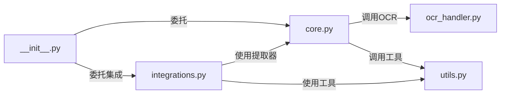
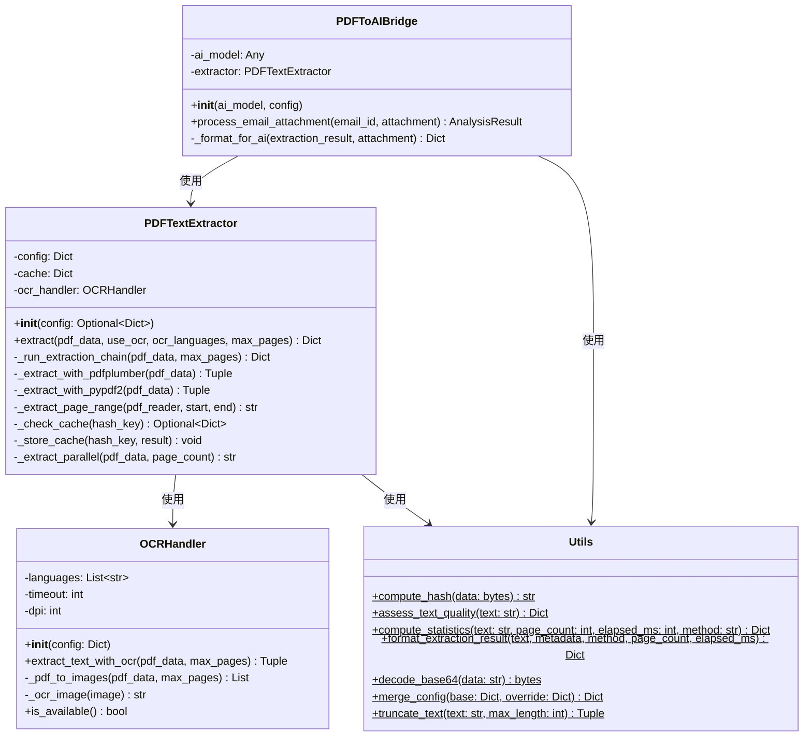
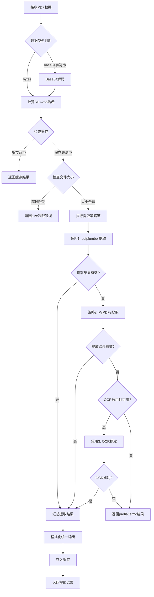
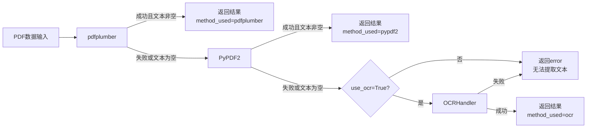
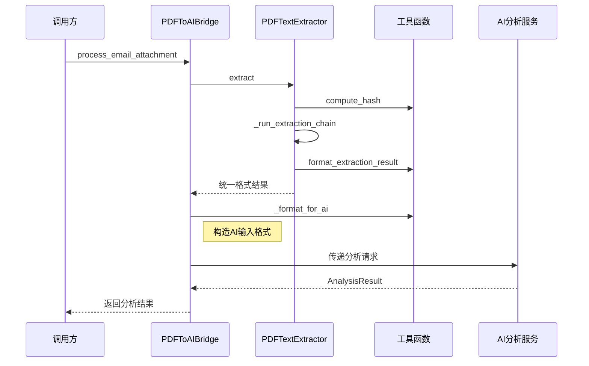
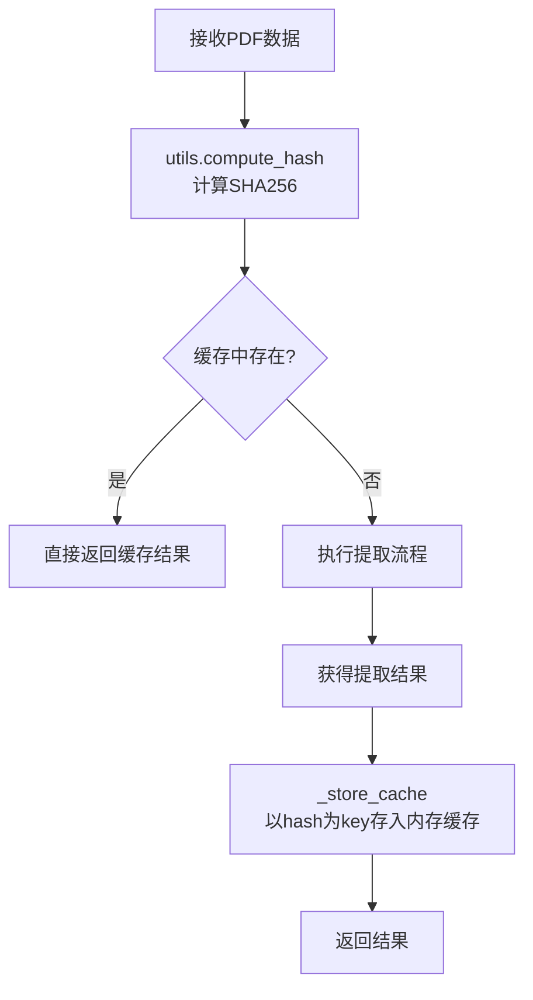
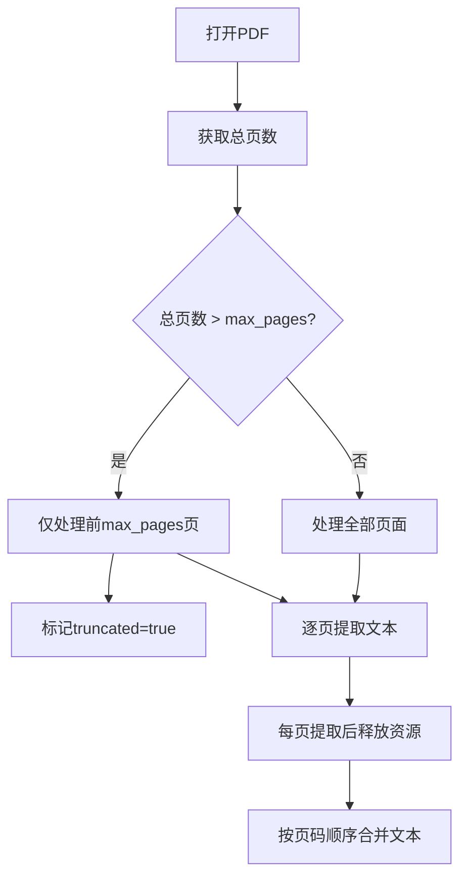
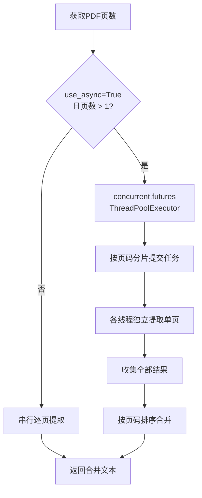
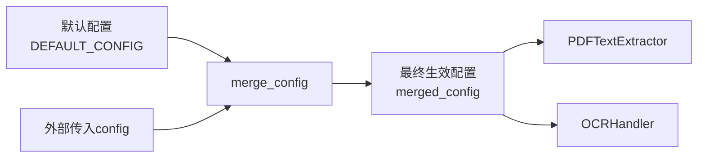

# 架构设计文档 - PDF文本提取模块

## 1. 架构概述

### 1.1 架构目标

- **可扩展性**: 采用策略模式设计提取器链，新增提取策略只需实现统一接口，无需修改核心逻辑
- **高可用性**: 多策略降级链确保在各种PDF类型下都能返回有效结果，单策略失败不影响整体
- **可维护性**: 模块按职责划分为5个文件，每个文件聚焦单一职责，便于定位和修改

### 1.2 架构原则

- **单一职责原则**: 每个类/模块只负责一项功能（提取、OCR、格式化、集成各自独立）
- **开闭原则**: 通过策略模式支持扩展新的提取器，无需修改已有代码
- **依赖倒置原则**: 核心逻辑依赖抽象的提取器接口，不依赖具体的提取库实现

### 1.3 技术栈选择

| 技术 | 用途 | 选择理由 |
|------|------|----------|
| pdfplumber | 首选文本提取器 | 表格布局保持优秀，文本提取质量高，支持字符级精确定位 |
| PyPDF2 | 备选文本提取器 | 纯Python实现，无系统依赖，兼容性广，作为pdfplumber失败的兜底方案 |
| pdf2image | PDF转图片 | OCR前置步骤，将PDF页面渲染为高质量图片，基于poppler |
| pytesseract | OCR文字识别 | 基于Tesseract引擎，支持100+语言，开源免费，社区活跃 |

---

## 2. 系统架构

### 2.1 整体架构图

```mermaid
graph TB
    subgraph Node.js主系统
        A[邮件分析服务<br/>emailAnalyzer.js]
        B[附件提取器<br/>attachmentExtractor.js]
        C[AI报告服务<br/>aiReportService.js]
    end

    subgraph PDF文本提取模块<br/>pdf_extractor/
        D[__init__.py<br/>公共接口导出]
        E[core.py<br/>PDFTextExtractor类]
        F[ocr_handler.py<br/>OCRHandler类]
        G[utils.py<br/>工具函数集]
        H[integrations.py<br/>PDFToAIBridge类]
    end

    subgraph 外部依赖
        I[pdfplumber库]
        J[PyPDF2库]
        K[pdf2image库]
        L[pytesseract库]
        M[Tesseract OCR引擎]
    end

    A -->|PDF附件数据| B
    B -->|调用PDF提取API| D
    D -->|委托执行| E
    E -->|文本提取策略1| I
    E -->|文本提取策略2| J
    E -->|OCR降级| F
    F -->|PDF转图片| K
    F -->|OCR识别| L
    L -->|调用引擎| M
    E -->|提取结果| G
    E -->|格式化结果| H
    H -->|AI输入格式| C
```

### 2.2 架构分层

#### 2.2.1 接口层 - __init__.py

- 导出模块公共API：`extract_pdf_content` 函数和 `PDFToAIBridge` 类
- 作为模块唯一对外入口，隐藏内部实现细节

#### 2.2.2 核心层 - core.py

- PDFTextExtractor 类：主提取逻辑编排
- 管理提取策略链的执行顺序
- 协调缓存、分页、并行等横切关注点
- 依赖 utils.py 进行工具函数调用，依赖 ocr_handler.py 进行OCR处理

#### 2.2.3 处理层 - ocr_handler.py

- OCRHandler 类：OCR相关逻辑封装
- PDF页面转图片、OCR识别、OCR参数管理
- 独立于核心逻辑，可单独替换OCR引擎

#### 2.2.4 工具层 - utils.py

- 哈希计算（SHA256缓存键生成）
- 文本质量评估
- 统计信息计算
- Base64编解码
- 配置合并与校验

#### 2.2.5 集成层 - integrations.py

- PDFToAIBridge 类：PDF提取模块与AI系统的桥接
- 将提取结果转换为AI系统期望的输入格式
- 异步调用AI分析接口

---

## 3. 服务设计

### 3.1 模块文件职责

| 文件 | 职责 | 核心类/函数 | 对外接口 |
|------|------|-------------|----------|
| __init__.py | 模块初始化，导出公共API | - | extract_pdf_content, PDFToAIBridge |
| core.py | 主提取逻辑编排 | PDFTextExtractor | extract, extract_page |
| ocr_handler.py | OCR处理逻辑 | OCRHandler | extract_text_with_ocr |
| utils.py | 工具函数 | compute_hash, assess_quality等 | 纯函数集合 |
| integrations.py | AI系统集成 | PDFToAIBridge | process_email_attachment |

### 3.2 模块间通信

模块内部采用直接函数/方法调用，无异步消息队列需求。



### 3.3 API设计

#### 3.3.1 核心提取接口 - extract_pdf_content

- **路径**: 通过 `from pdf_extractor import extract_pdf_content` 导入
- **类型**: 同步函数
- **描述**: 接收PDF原始数据，返回统一格式的提取结果
- **请求参数**:

  | 参数名 | 类型 | 必填 | 默认值 | 描述 |
  |--------|------|------|--------|------|
  | pdf_data | Union[bytes, str] | 是 | - | PDF原始数据，支持bytes或base64字符串 |
  | use_ocr | bool | 否 | False | 是否启用OCR降级 |
  | ocr_languages | List[str] | 否 | [eng] | OCR语言列表 |
  | max_pages | int | 否 | 50 | 最大处理页数 |
  | config | Optional[Dict] | 否 | None | 外部化配置参数 |

- **响应格式**:

  ```json
  {
    "status": "success|partial|error",
    "data": {
      "extracted_text": "提取的完整文本内容",
      "summary": "前500字符摘要",
      "statistics": {
        "word_count": 1500,
        "page_count": 10,
        "extraction_time_ms": 1200,
        "method_used": "pypdf2|pdfplumber|ocr"
      },
      "quality_indicators": {
        "has_scanned_pages": false,
        "extraction_confidence": 0.95,
        "needs_human_review": false
      }
    },
    "compatibility": {
      "ai_ready": true,
      "format": "ai_analysis_v1",
      "truncated": false
    }
  }
  ```

#### 3.3.2 AI集成接口 - process_email_attachment

- **路径**: 通过 `PDFToAIBridge` 类实例方法调用
- **类型**: 异步方法
- **描述**: 处理邮件PDF附件，提取文本后交由AI分析
- **请求参数**:

  | 参数名 | 类型 | 必填 | 描述 |
  |--------|------|------|------|
  | email_id | str | 是 | 邮件唯一标识 |
  | attachment | EmailAttachment | 是 | 邮件附件对象 |

- **响应格式**: 返回 AnalysisResult 对象（现有AI系统定义的类型）

---

## 4. 核心类设计

### 4.1 类关系图



### 4.2 PDFTextExtractor 类

**职责**: 编排整个PDF文本提取流程，包括策略选择、缓存管理、分页控制和并行处理。

**核心方法**:

| 方法 | 类型 | 描述 |
|------|------|------|
| `__init__(config)` | 构造 | 初始化配置、缓存、OCRHandler实例 |
| `extract(pdf_data, use_ocr, ocr_languages, max_pages)` | 公开 | 主提取入口，返回统一格式结果 |
| `_run_extraction_chain(pdf_data, max_pages)` | 私有 | 执行提取策略降级链 |
| `_extract_with_pdfplumber(pdf_data)` | 私有 | pdfplumber策略提取 |
| `_extract_with_pypdf2(pdf_data)` | 私有 | PyPDF2策略提取 |
| `_extract_page_range(reader, start, end)` | 私有 | 分页范围提取 |
| `_check_cache(hash_key)` | 私有 | 检查缓存 |
| `_store_cache(hash_key, result)` | 私有 | 存入缓存 |
| `_extract_parallel(pdf_data, page_count)` | 私有 | 并行提取多页 |

### 4.3 OCRHandler 类

**职责**: 封装OCR相关操作，包括PDF转图片和OCR文字识别。

**核心方法**:

| 方法 | 类型 | 描述 |
|------|------|------|
| `__init__(config)` | 构造 | 初始化OCR参数（语言、超时、DPI） |
| `extract_text_with_ocr(pdf_data, max_pages)` | 公开 | 执行OCR提取流程 |
| `is_available()` | 公开 | 检查OCR环境是否可用 |
| `_pdf_to_images(pdf_data, max_pages)` | 私有 | PDF页面转图片列表 |
| `_ocr_image(image)` | 私有 | 单张图片OCR识别 |

### 4.4 PDFToAIBridge 类

**职责**: 桥接PDF提取模块与现有AI安全分析系统，将提取结果转换为AI期望的输入格式。

**核心方法**:

| 方法 | 类型 | 描述 |
|------|------|------|
| `__init__(ai_model, config)` | 构造 | 初始化AI模型和提取器实例 |
| `process_email_attachment(email_id, attachment)` | 公开异步 | 完整处理流程：提取→格式化→AI分析 |
| `_format_for_ai(extraction_result, attachment)` | 私有 | 将提取结果转为AI输入格式 |

---

## 5. 数据流设计

### 5.1 主提取流程



### 5.2 提取策略降级链



**文本有效性判断标准**:
- 提取文本去除空白字符后长度大于0
- 文本非全为特殊字符或乱码

### 5.3 AI集成数据流



### 5.4 AI系统输入格式

PDFToAIBridge 将提取结果转换为以下AI系统期望的格式：

```json
{
    "type": "email_attachment",
    "format": "pdf",
    "content": "提取的文本内容（已截断至max_text_length）",
    "metadata": {
        "filename": "附件文件名",
        "size": "文件大小（字节）",
        "hash": "SHA256哈希值",
        "extraction_method": "pdfplumber|pypdf2|ocr"
    },
    "timestamp": "ISO 8601时间戳"
}
```

---

## 6. 关键机制设计

### 6.1 缓存机制



- **缓存键**: PDF原始数据的SHA256哈希值（十六进制字符串）
- **缓存值**: 完整的统一格式提取结果
- **缓存开关**: 通过配置 `performance.cache_results` 控制启用/禁用
- **缓存存储**: 进程内Dict，模块生命周期内有效

### 6.2 大文件分页处理



- **页数限制**: 默认50页，通过 `max_pages` 参数配置
- **文件大小限制**: 默认50MB，通过 `performance.max_file_size_mb` 配置
- **资源管理**: 使用上下文管理器确保每页资源及时释放

### 6.3 并行提取处理



- **并行策略**: 使用 `concurrent.futures.ThreadPoolExecutor`
- **任务粒度**: 每页一个提取任务
- **结果合并**: 按页码顺序合并，保证与串行结果一致
- **开关控制**: 通过配置 `performance.use_async` 启用/禁用

### 6.4 配置管理



**配置结构**:

| 配置项 | 默认值 | 描述 |
|--------|--------|------|
| primary_extractor | pdfplumber | 首选提取器 |
| fallback_extractors | [pypdf2, ocr] | 备选提取器列表 |
| ocr.enabled | True | OCR是否启用 |
| ocr.language | [eng, chi_sim] | OCR语言 |
| ocr.timeout | 30 | OCR超时秒数 |
| ocr.dpi | 300 | PDF转图片DPI |
| performance.max_file_size_mb | 50 | 最大文件大小MB |
| performance.max_pages | 100 | 最大处理页数 |
| performance.use_async | True | 是否并行处理 |
| performance.cache_results | True | 是否启用缓存 |
| ai_integration.max_text_length | 10000 | AI最大文本长度 |
| ai_integration.include_metadata | True | 是否包含元数据 |
| ai_integration.format_version | 1.0 | 输出格式版本 |

---

## 7. 错误处理设计

### 7.1 错误分类与处理策略

| 错误场景 | 处理策略 | 返回状态 |
|----------|----------|----------|
| PDF数据为空或无效 | 直接返回错误信息 | status=error |
| PDF文件加密 | 返回明确提示 | status=error, 提示PDF已加密 |
| PDF文件损坏 | 降级到下一个提取策略 | 最终status=error |
| pdfplumber提取失败 | 降级到PyPDF2 | 继续处理 |
| PyPDF2提取失败 | 降级到OCR或返回error | 视OCR配置而定 |
| OCR服务不可用 | 跳过OCR，返回已提取的部分结果 | status=partial |
| OCR处理超时 | 返回已提取的部分结果 | status=partial |
| 文件超过大小限制 | 返回明确错误 | status=error |
| 所有提取器均失败 | 返回最后一次错误信息 | status=error |

### 7.2 降级策略执行规则

- 每个提取策略独立捕获异常，不向上抛出
- 记录每个策略的失败原因，最终汇总到错误信息中
- 部分提取成功时（部分页面成功），返回 status=partial 并包含已提取文本

---

## 8. 需求覆盖矩阵

| 需求ID | 需求描述 | 设计覆盖位置 |
|--------|----------|--------------|
| FR-001 | PDF文本提取核心功能 | §3.3.1 extract_pdf_content接口, §4.2 PDFTextExtractor类 |
| FR-002 | 多策略文本提取 | §5.2 提取策略降级链, §4.2 _run_extraction_chain方法 |
| FR-003 | OCR文本提取 | §4.3 OCRHandler类, §5.2 OCR降级分支 |
| FR-004 | 统一输出格式化 | §3.3.1 响应格式, §4.2 format_extraction_result |
| FR-005 | AI系统集成接口 | §3.3.2 process_email_attachment接口, §4.4 PDFToAIBridge类 |
| FR-006 | 错误处理与优雅降级 | §7 错误处理设计, §7.1 错误分类表 |
| FR-007 | 大文件分页处理 | §6.2 大文件分页处理机制 |
| FR-008 | 缓存机制 | §6.1 缓存机制设计 |
| FR-009 | 并行提取处理 | §6.3 并行提取处理机制 |
| FR-010 | 配置管理 | §6.4 配置管理设计 |
| FR-011 | 模块结构 | §3.1 模块文件职责表, §2.2 架构分层 |
