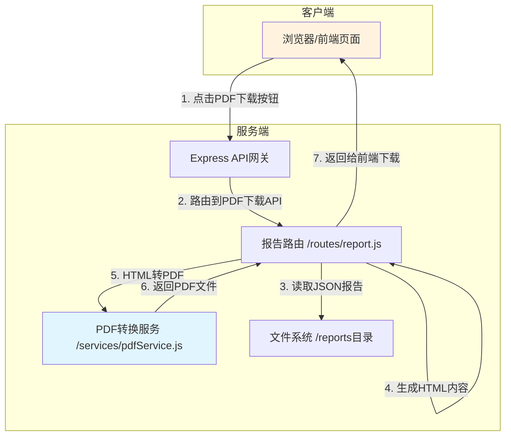

# 沙箱安全分析系统 PDF报告下载功能 技术设计文档

## 1. 架构概述

### 1.1 架构目标

- **可扩展性**: 支持未来增加其他格式导出（如Word）
- **易用性**: 用户可以在报告查看页面一键下载PDF
- **稳定性**: 服务端转换具备完善的错误处理机制

### 1.2 架构原则

- 单一职责原则：PDF转换服务独立模块化
- 开闭原则：新增PDF导出功能不修改现有HTML下载逻辑
- 依赖倒置原则：前端通过API调用，不直接依赖转换实现

## 2. 系统架构

### 2.1 整体架构图



### 2.2 数据流设计

```
1. 用户点击"下载PDF"按钮
2. 前端发起请求: GET /api/report/:id/download/pdf
3. 后端路由接收请求
4. 读取JSON报告文件
5. 生成HTML内容 (调用 generateHTMLReport)
6. HTML内容转换为PDF (调用 pdfService)
7. 返回PDF文件给前端
8. 浏览器触发下载
```

## 3. 技术方案

### 3.1 PDF转换库选型

#### 方案对比

| 特性 | pdfkit | puppeteer | html-pdf |
|------|--------|-----------|----------|
| 安装复杂度 | 低 | 高(需Chrome) | 中 |
| CSS支持 | 基础 | 完整 | 基础 |
| 中文支持 | 需配置字体 | 良好 | 需配置 |
| Windows兼容性 | 良好 | 良好 | 一般 |
| 转换性能 | 快 | 较慢 | 中 |
| 依赖大小 | 小 | 大 | 中 |

#### 选型结论: pdfkit

**理由**:
1. 安装简单，无外部浏览器依赖
2. 性能好，转换速度快
3. 完全控制PDF生成过程
4. 适合服务器端自动化处理
5. 可自定义字体支持中文

### 3.2 PDF转换服务设计

```javascript
// services/pdfService.js 主要接口

/**
 * 将HTML内容转换为PDF
 * @param {string} htmlContent - HTML内容
 * @param {Object} options - 配置选项
 * @returns {Promise<Buffer>} - PDF文件Buffer
 */
async function convertHtmlToPdf(htmlContent, options)
```

**配置选项**:
- pageSize: A4 (默认)
- margin: 20mm
- timeout: 30000ms
- fontPath: 思源黑体字体路径

## 4. API设计

### 4.1 PDF下载API

#### API: GET /api/report/:id/download/pdf

**请求参数**:
| 参数 | 类型 | 必填 | 描述 |
|------|------|------|------|
| id | string | 是 | 报告ID (URL参数) |

**响应头**:
```
Content-Type: application/pdf
Content-Disposition: attachment; filename="报告名.pdf"; filename*=UTF-8''编码后的文件名
```

**成功响应**:
- 状态码: 200
- Body: PDF二进制文件

**错误响应**:
```json
{
  "success": false,
  "error": "PDF转换失败: [具体错误信息]",
  "fallback": "/api/report/:id/download (HTML下载)"
}
```

## 5. 前端设计

### 5.1 报告查看页面按钮布局

在现有报告操作按钮栏添加PDF下载按钮:

```html
<!-- 现有按钮 -->
<button class="report-action-btn btn-download" onclick="downloadCurrentReport()">
    <i class="bi bi-download"></i>
    下载报告
</button>

<!-- 新增PDF下载按钮 -->
<button class="report-action-btn btn-download-pdf" onclick="downloadPdfReport()">
    <i class="bi bi-file-earmark-pdf"></i>
    下载PDF
</button>
```

### 5.2 PDF下载函数设计

```javascript
// public/js/app.js

/**
 * 下载PDF报告
 */
async function downloadPdfReport() {
    if (!currentReportMeta) {
        alert('没有可下载的报告');
        return;
    }

    try {
        // 显示下载状态
        showAIStatus('正在生成PDF...', '正在将报告转换为PDF格式，请稍候...', 10);

        const reportId = currentReportMeta.id;
        const response = await fetch(`/api/report/${reportId}/download/pdf`);

        if (!response.ok) {
            const errorData = await response.json();
            throw new Error(errorData.error || 'PDF生成失败');
        }

        updateAIStatusProgress(80, '正在下载PDF文件...');
        
        const blob = await response.blob();
        
        // 获取文件名
        let filename = `${reportId}.pdf`;
        const contentDisposition = response.headers.get('Content-Disposition');
        if (contentDisposition) {
            const utf8Match = contentDisposition.match(/filename\*=UTF-8''([^;]+)/i);
            if (utf8Match) {
                filename = decodeURIComponent(utf8Match[1]);
            }
        }

        // 触发下载
        const url = window.URL.createObjectURL(blob);
        const a = document.createElement('a');
        a.href = url;
        a.download = filename;
        document.body.appendChild(a);
        a.click();
        window.URL.revokeObjectURL(url);
        document.body.removeChild(a);

        updateAIStatusProgress(100, 'PDF下载完成！');
        setTimeout(hideAIStatus, 1500);
        
    } catch (error) {
        hideAIStatus();
        console.error('PDF下载失败:', error);
        
        // 显示友好错误提示，并提供HTML下载备选
        const useHtml = confirm(
            `PDF生成失败: ${error.message}\n\n是否改为下载HTML格式报告？`
        );
        
        if (useHtml) {
            downloadCurrentReport();
        }
    }
}
```

### 5.3 CSS样式

```css
/* 新增PDF下载按钮样式 */
.btn-download-pdf {
    background: linear-gradient(135deg, #dc3545, #c82333);
    color: white;
}

.btn-download-pdf:hover {
    transform: translateY(-2px);
    box-shadow: 0 4px 12px rgba(220, 53, 69, 0.4);
}
```

## 6. 错误处理机制

### 6.1 错误类型与处理策略

| 错误类型 | 原因 | 处理策略 |
|----------|------|----------|
| 报告不存在 | JSON文件被删除 | 返回404，提示用户 |
| HTML生成失败 | AI报告内容异常 | 返回HTML兜底内容 |
| PDF转换超时 | 转换耗时过长 | 30秒超时，返回错误 |
| PDF转换失败 | 库执行错误 | 记录日志，返回友好错误 |
| 字体缺失 | 中文字体未安装 | 使用默认字体或嵌入字体 |

### 6.2 错误响应格式

```json
{
    "success": false,
    "error": "错误类型: 具体错误信息",
    "code": "ERROR_CODE",
    "fallback": "/api/report/xxx/download",
    "suggestion": "建议用户尝试HTML下载"
}
```

### 6.3 日志记录

转换失败时记录详细日志:
```javascript
console.error('[PDF转换] 报告ID:', reportId);
console.error('[PDF转换] 错误类型:', errorType);
console.error('[PDF转换] 错误详情:', error);
console.error('[PDF转换] HTML长度:', htmlContent.length);
```

## 7. 服务端实现要点

### 7.1 路由添加

在 `routes/report.js` 中添加:

```javascript
/**
 * 下载PDF报告
 * GET /api/report/:id/download/pdf
 */
router.get('/:id/download/pdf', async (req, res) => {
    try {
        const reportId = req.params.id;
        const reportPath = path.join(reportDir, `${reportId}.json`);

        if (!fs.existsSync(reportPath)) {
            return res.status(404).json({
                success: false,
                error: '报告不存在',
                code: 'REPORT_NOT_FOUND'
            });
        }

        const reportContent = fs.readFileSync(reportPath, 'utf-8');
        const report = JSON.parse(reportContent);

        // 生成HTML内容
        const htmlContent = generateHTMLReport(report);

        // 转换为PDF
        const pdfBuffer = await pdfService.convertHtmlToPdf(htmlContent, {
            title: report.displayId + ' 安全分析报告'
        });

        // 设置响应头
        res.setHeader('Content-Type', 'application/pdf');
        
        let displayName = report.displayId || reportId;
        const encodedFilename = encodeURIComponent(`${displayName}.pdf`);
        const asciiFilename = displayName.replace(/[^\x00-\x7F]/g, '_') + '.pdf';
        
        res.setHeader('Content-Disposition',
            `attachment; filename="${asciiFilename}"; filename*=UTF-8''${encodedFilename}`);

        res.send(pdfBuffer);
        
    } catch (error) {
        console.error('PDF下载失败:', error);
        res.status(500).json({
            success: false,
            error: `PDF转换失败: ${error.message}`,
            code: 'PDF_CONVERSION_FAILED',
            fallback: `/api/report/${req.params.id}/download`
        });
    }
});
```

### 7.2 PDF服务模块

创建 `services/pdfService.js`:

```javascript
const PDFDocument = require('pdfkit');
const fs = require('fs');
const path = require('path');

/**
 * 将HTML内容转换为PDF
 * @param {string} htmlContent - HTML内容
 * @param {Object} options - 配置选项
 * @returns {Promise<Buffer>}
 */
async function convertHtmlToPdf(htmlContent, options = {}) {
    return new Promise((resolve, reject) => {
        try {
            const doc = new PDFDocument({
                size: options.pageSize || 'A4',
                margins: {
                    top: options.margin || 20,
                    bottom: options.margin || 20,
                    left: options.margin || 20,
                    right: options.margin || 20
                },
                info: {
                    Title: options.title || '安全分析报告',
                    Author: '沙箱安全分析系统',
                    Subject: '安全检测报告'
                }
            });

            const chunks = [];
            doc.on('data', chunk => chunks.push(chunk));
            doc.on('end', () => {
                resolve(Buffer.concat(chunks));
            });
            doc.on('error', reject);

            // 解析HTML内容并写入PDF
            // 此处需要HTML解析器将HTML内容转换为PDF
            // 使用简单的文本提取 + PDF写入
            
            // 注册中文字体
            const fontPath = path.join(__dirname, '..', 'fonts', 'NotoSansSC-Regular.ttf');
            if (fs.existsSync(fontPath)) {
                doc.registerFont('NotoSansSC', fontPath);
                doc.font('NotoSansSC');
            }

            // 简单处理：提取纯文本写入
            // 实际实现需要HTML解析
            const textContent = stripHtml(htmlContent);
            
            doc.fontSize(12);
            const lines = textContent.split('\n');
            for (const line of lines) {
                if (line.trim()) {
                    doc.text(line, {
                        align: 'left',
                        lineGap: 4
                    });
                }
            }

            doc.end();
            
        } catch (error) {
            reject(error);
        }
    });
}

/**
 * 简单的HTML标签去除
 */
function stripHtml(html) {
    return html
        .replace(/<style[\s\S]*?<\/style>/gi, '')
        .replace(/<script[\s\S]*?<\/script>/gi, '')
        .replace(/<[^>]+>/g, '\n')
        .replace(/&nbsp;/g, ' ')
        .replace(/</g, '<')
        .replace(/>/g, '>')
        .replace(/\n{3,}/g, '\n\n');
}

module.exports = {
    convertHtmlToPdf
};
```

## 8. 依赖安装

```bash
# 安装pdfkit
npm install pdfkit
```

## 9. 验收标准

### 9.1 功能验收

- [ ] 报告查看页面包含"下载PDF"按钮
- [ ] 点击按钮可以下载PDF文件
- [ ] PDF文件名包含正确的报告名
- [ ] PDF内容与HTML报告内容一致
- [ ] PDF中中文显示正常

### 9.2 错误处理验收

- [ ] 报告不存在时返回404错误
- [ ] PDF转换失败时显示友好错误提示
- [ ] 转换失败时提供HTML下载备选
- [ ] 错误日志正确记录

### 9.3 性能验收

- [ ] PDF转换在30秒内完成
- [ ] 大型报告不阻塞服务器

## 10. 文件清单

| 文件 | 操作 | 描述 |
|------|------|------|
| services/pdfService.js | 新建 | PDF转换服务模块 |
| routes/report.js | 修改 | 添加PDF下载API端点 |
| public/index.html | 修改 | 添加PDF按钮CSS样式 |
| public/js/app.js | 修改 | 添加PDF下载函数 |
| package.json | 修改 | 添加pdfkit依赖 |