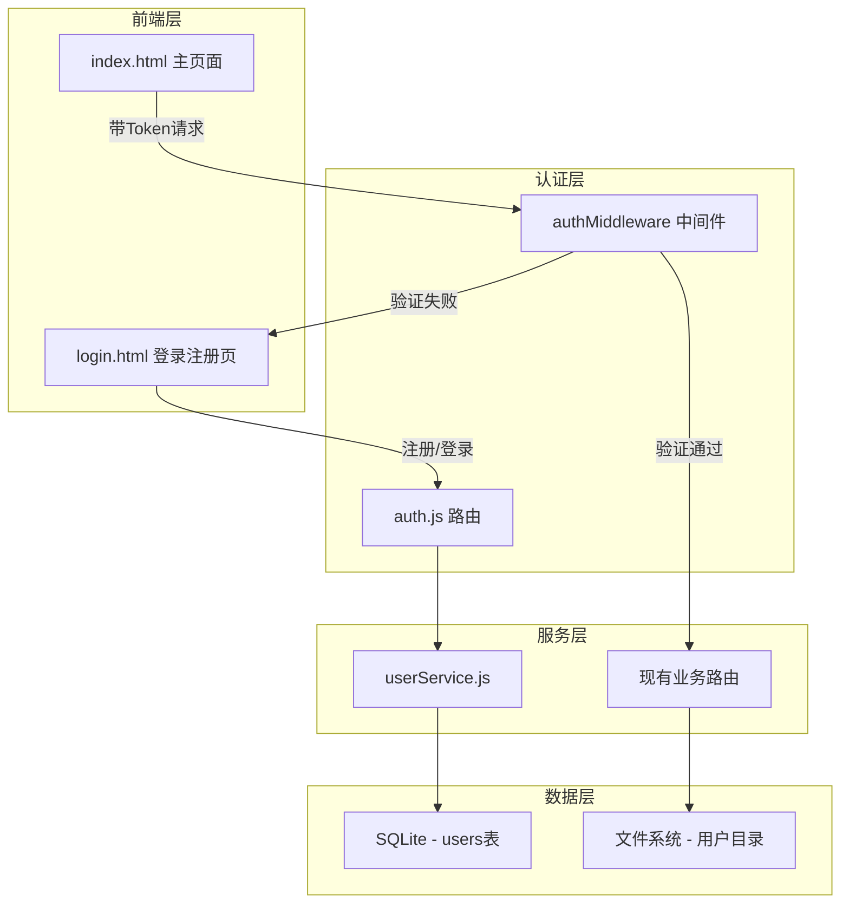
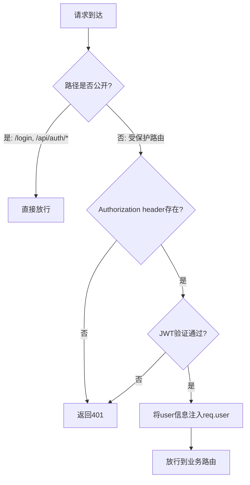
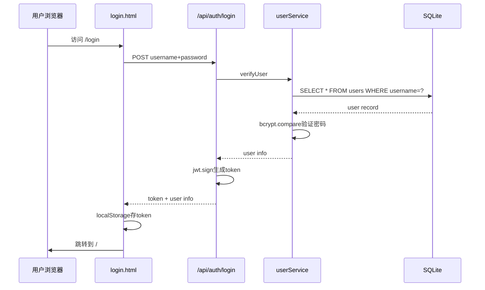
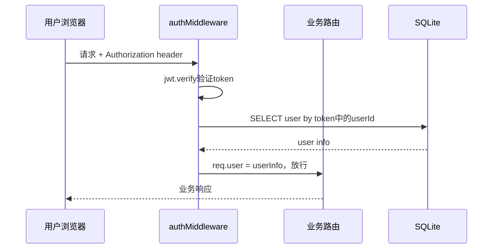

# 用户登录与数据隔离系统 - 设计文档

## 1. 架构概述

### 1.1 架构目标
- **可扩展性**: 基于JWT无状态认证，便于后续扩展多节点部署
- **高可用性**: SQLite单文件数据库，无需外部数据库服务，零运维开销
- **可维护性**: 认证逻辑集中化，中间件统一拦截

### 1.2 架构原则
- 单一职责原则：认证服务独立于业务逻辑
- 开闭原则：通过中间件机制扩展认证能力，不修改核心业务逻辑
- 依赖倒置原则：路由层依赖抽象的认证接口，不直接依赖实现

## 2. 系统架构

### 2.1 整体架构图



### 2.2 架构分层

#### 2.2.1 表示层
- **login.html**: 独立登录/注册页面，浅蓝色矩形设计风格
- **index.html**: 现有主页面，新增导航栏用户信息展示

#### 2.2.2 业务层
- **auth.js路由**: 处理注册、登录、Token验证
- **authMiddleware**: JWT验证中间件，拦截所有受保护路由
- **userService.js**: 用户CRUD操作、密码哈希验证

#### 2.2.3 数据层
- **SQLite数据库**: 存储用户账号信息
- **文件系统**: 按用户ID隔离的目录结构

## 3. 服务设计

### 3.1 新增文件清单

| 文件路径 | 职责 | 说明 |
|---------|------|------|
| `database/init.js` | 数据库初始化 | SQLite连接、建表 |
| `services/userService.js` | 用户服务 | 注册、登录、查用户 |
| `routes/auth.js` | 认证路由 | REST API端点 |
| `middleware/auth.js` | 认证中间件 | JWT验证拦截 |
| `public/login.html` | 登录页面 | 登录/注册UI |

### 3.2 修改文件清单

| 文件路径 | 修改内容 |
|---------|---------|
| `server.js` | 引入数据库初始化、认证路由、受保护路由包装 |
| `package.json` | 新增 better-sqlite3、bcryptjs、jsonwebtoken |
| `.env` | 新增 JWT_SECRET |
| `routes/report.js` | 报告关联userId，按用户查询 |
| `routes/upload.js` | 文件存入用户子目录 |
| `routes/sandbox.js` | 增加认证中间件 |
| `routes/ai.js` | 增加认证中间件 |
| `routes/attachment.js` | 增加认证中间件 |
| `public/index.html` | 导航栏增加用户信息和退出按钮 |
| `public/js/app.js` | 所有fetch增加Authorization header，401跳转处理 |

### 3.3 API设计

#### 3.3.1 用户注册
- **URL**: `/api/auth/register`
- **Method**: POST
- **描述**: 用户自助注册
- **请求参数**:
```json
{
    "username": "string, 3-20位字母数字",
    "password": "string, 至少6位"
}
```
- **响应格式**:
```json
{
    "code": 200,
    "data": {
        "token": "jwt_token_string",
        "user": {
            "id": 1,
            "username": "testuser"
        }
    },
    "message": "注册成功"
}
```

#### 3.3.2 用户登录
- **URL**: `/api/auth/login`
- **Method**: POST
- **描述**: 用户登录获取Token
- **请求参数**:
```json
{
    "username": "string",
    "password": "string",
    "rememberMe": false
}
```
- **响应格式**:
```json
{
    "code": 200,
    "data": {
        "token": "jwt_token_string",
        "user": {
            "id": 1,
            "username": "testuser"
        }
    },
    "message": "登录成功"
}
```

#### 3.3.3 Token验证
- **URL**: `/api/auth/verify`
- **Method**: GET
- **描述**: 验证Token有效性，返回用户信息
- **请求头**: `Authorization: Bearer <token>`
- **响应格式**:
```json
{
    "code": 200,
    "data": {
        "user": {
            "id": 1,
            "username": "testuser"
        }
    },
    "message": "有效"
}
```

#### 3.3.4 退出登录
- **URL**: `/api/auth/logout`
- **Method**: POST
- **描述**: 前端清除Token即可，后端为一致性提供端点
- **响应格式**:
```json
{
    "code": 200,
    "message": "已退出"
}
```

### 3.4 认证中间件设计



**公开路由（无需认证）**:
- `GET /login` - 登录页面
- `POST /api/auth/register` - 注册
- `POST /api/auth/login` - 登录
- `GET /health` - 健康检查
- 静态资源文件

## 4. 数据架构

### 4.1 数据存储策略

- **SQLite数据库**: 用户账号信息、密码哈希
- **文件系统**: 按用户隔离的上传文件和报告

### 4.2 数据库表设计

#### users 表

| 字段名 | 类型 | 约束 | 说明 |
|--------|------|------|------|
| id | INTEGER | PRIMARY KEY AUTOINCREMENT | 用户ID |
| username | TEXT | UNIQUE NOT NULL | 用户名 |
| password_hash | TEXT | NOT NULL | bcrypt哈希密码 |
| created_at | TEXT | DEFAULT CURRENT_TIMESTAMP | 创建时间 |
| last_login | TEXT | | 最后登录时间 |

#### reports 表（替代原文件系统中的JSON元数据）

| 字段名 | 类型 | 约束 | 说明 |
|--------|------|------|------|
| id | TEXT | PRIMARY KEY | 报告ID |
| user_id | INTEGER | FOREIGN KEY -> users.id | 所属用户 |
| display_id | TEXT | | 显示用ID |
| filename | TEXT | | 原始文件名 |
| risk_level | TEXT | | 风险等级 |
| tool_used | TEXT | | 分析工具 |
| created_at | TEXT | DEFAULT CURRENT_TIMESTAMP | 创建时间 |
| report_file | TEXT | | JSON报告文件路径 |

### 4.3 文件目录结构

```
uploads/
├── user_{userId}/
│   ├── file1.eml
│   └── file2.pdf

reports/
├── user_{userId}/
│   ├── report-xxx.json
│   └── report-yyy.json

database/
├── app.db          # SQLite数据库文件
```

### 4.4 数据一致性

- **强一致性场景**: 用户注册时用户名唯一性校验、登录时密码验证
- **最终一致性场景**: 报告文件与数据库记录同步（写入时保证）

## 5. 认证流程

### 5.1 登录流程



### 5.2 请求认证流程



## 6. 新增依赖说明

| 依赖包 | 版本 | 用途 | 选择理由 |
|--------|------|------|---------|
| better-sqlite3 | latest | SQLite数据库驱动 | 同步API、性能优异、无需外部数据库服务 |
| bcryptjs | latest | 密码哈希 | 纯JS实现、无native编译依赖、跨平台 |
| jsonwebtoken | latest | JWT生成与验证 | Node.js生态标准JWT库 |

## 7. 前端交互设计

### 7.1 登录页面
- 独立页面 `login.html`，URL为 `/login`
- 左右分栏布局：左侧品牌标识、右侧登录/注册表单
- 登录/注册Tab切换
- 与现有页面保持一致的浅蓝色矩形设计风格
- 支持Enter键提交

### 7.2 主页面改动
- 导航栏右侧显示用户名 + 退出按钮
- 页面加载时检查Token有效性
- 所有fetch请求添加 `Authorization: Bearer <token>` header
- 接收401响应时自动清除Token并跳转 `/login`

### 7.3 Token管理
- 存储在 `localStorage` 中
- Key: `auth_token`
- 页面加载时验证，过期则跳转登录页
